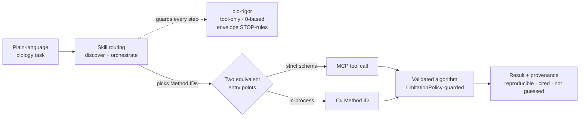

# Seqeron Agent Skills

**A routing + discipline layer that turns a 427-tool bioinformatics library into an assistant which
solves whole biological tasks.** You describe the task in plain language; the right skill loads
itself, picks the correct tools, chains a multi-step pipeline, and keeps the science honest — every
number computed by a validated algorithm, never guessed.

These are [Anthropic Agent Skills](https://docs.anthropic.com/en/docs/claude-code/skills). They live
here for **Claude Code** and are mirrored byte-for-byte into [`.github/skills/`](../../.github/skills)
for **GitHub Copilot / VS Code**. Everything a skill does works two ways — over an **MCP tool call**
or the equivalent **C# `Method ID`** — so you never need MCP unless you want it.

## Contents

- [Why a skill layer](#why-a-skill-layer)
- [Using the skills](#using-the-skills)
- [The catalog](#the-catalog)
  - [Start here — cross-cutting skills](#start-here--cross-cutting-skills)
  - [Domain skills](#domain-skills)
- [How a task flows](#how-a-task-flows)
- [The rigor guarantee](#the-rigor-guarantee)
- [Anatomy of a skill](#anatomy-of-a-skill)
- [Staying in sync — no drift](#staying-in-sync--no-drift)
- [Authoring a new skill](#authoring-a-new-skill)
- [See also](#see-also)

## Why a skill layer

With **427 tools across 11 MCP servers**, attaching every schema drowns the model — thousands of
tokens of tool definitions before it reads a word of your question. Skills solve this with
**progressive disclosure**: only a skill's one-line `description` sits in context. When your request
matches, its body loads and teaches the model to do three things well —

- **Discover** the right tool among 427 (without loading all the schemas),
- **Orchestrate** a correct multi-step pipeline (QC → align → call variant → design primer),
- **Stay honest** — compute with tools, respect each algorithm's validated envelope, carry provenance.

The tool schemas themselves never enter the model's context; a skill only names the `Method ID`s to
call, and the numbers come from the real library.

## Using the skills

**In Claude Code — just describe the task.** No tool picking, no code. The matching skill triggers on
your wording and runs the pipeline:

> *"Here are two versions of a short gene — a wild type and a suspected resistance isolate. Confirm
> both are clean DNA, tell me exactly what changed and whether it alters the protein, and if it does,
> design me a PCR primer pair for a diagnostic."*

That one prompt routes through [`bio-qc`](bio-qc/SKILL.md) → [`bio-alignment`](bio-alignment/SKILL.md)
→ [`bio-annotation`](bio-annotation/SKILL.md) → [`bio-moldesign`](bio-moldesign/SKILL.md), guarded
throughout by [`bio-rigor`](bio-rigor/SKILL.md). (Full worked version:
[root README → "See it work"](../../README.md#see-it-work-a-resistance-mutation-triage).)

**In Copilot / VS Code —** the mirror under [`.github/skills/`](../../.github/skills) is loaded via the
repo's `.vscode/settings.json`; describe the task the same way.

**Two engines, one answer.** Every recipe is **dual-mode**: run it over MCP (LLM client) or call the
same validated algorithm in-process via the **C# API** ([`seqeron-dev`](seqeron-dev/SKILL.md)). The
math is identical either way.

**First time on a fresh clone?** Just ask **"install and configure"** — that fires
[`seqeron-setup`](seqeron-setup/SKILL.md) (checks .NET 10 + Python, builds the 11 servers into an
on-demand cache, runs a live smoke test). Or run `scripts/setup.sh`.

## The catalog

**21 skills** — 5 cross-cutting, 16 domain. Each links to its `SKILL.md`.

### Start here — cross-cutting skills

These apply across every task; the first three fire automatically when relevant.

| Skill | What it does | Fires when… |
|-------|--------------|-------------|
| [`bio-rigor`](bio-rigor/SKILL.md) | Enforces tool-only computation, provenance, 0-based coordinates, and each algorithm's envelope STOP-rules. Always on. | you compute any result from real data |
| [`seqeron-discovery`](seqeron-discovery/SKILL.md) | Finds the right tool/algorithm among 427 **without** loading every schema. | "which Seqeron tool does X?" |
| [`seqeron-setup`](seqeron-setup/SKILL.md) | One-time install & configuration for a freshly cloned repo. | "install and configure", "get me started" |
| [`seqeron-dev`](seqeron-dev/SKILL.md) | The C# API path — namespaces, `LimitationPolicy`, `TryCreate`, conventions. | you call the library in-process, not over MCP |
| [`seqeron-python-client`](seqeron-python-client/SKILL.md) | Wrap any Seqeron MCP tool in a small Python script. | "make a python wrapper for this tool" |

### Domain skills

Each owns a slice of the library and knows its tools, pipelines, and validated limits.

| Skill | Domain | Try prompts |
|-------|--------|-------------|
| [`bio-qc`](bio-qc/SKILL.md) | Parse & QC sequences/files | "parse this FASTQ", "GC% of…", "is this valid DNA", "translate this ORF" |
| [`bio-alignment`](bio-alignment/SKILL.md) | Pairwise / MSA alignment & similarity | "align these", "how similar are X and Y", "find the conserved region" |
| [`bio-assembly`](bio-assembly/SKILL.md) | Assemble reads → contigs, QC | "assemble these reads", "compute N50", "coverage over the reference" |
| [`bio-annotation`](bio-annotation/SKILL.md) | Genes/ORFs/promoters, variants, motifs | "find ORFs", "call variants", "classify this variant", "what motifs are in…" |
| [`bio-moldesign`](bio-moldesign/SKILL.md) | Primers/probes/CRISPR, codon opt., restriction | "design primers", "find CRISPR guides + off-targets", "where does EcoRI cut" |
| [`bio-phylo-popgen`](bio-phylo-popgen/SKILL.md) | Phylogenetics + population genetics | "build a tree", "compute Fst", "test HWE", "Tajima's D" |
| [`bio-metagenomics`](bio-metagenomics/SKILL.md) | Microbial community profiling | "classify these reads", "Shannon diversity", "compare two samples", "bin these contigs" |
| [`bio-chromosome`](bio-chromosome/SKILL.md) | Chromosome/assembly-scale analysis | "detect aneuploidy", "find the centromere", "synteny blocks", "GC-skew" |
| [`seqeron-rna-structure`](seqeron-rna-structure/SKILL.md) | RNA secondary structure | "fold this RNA", "MFE of…", "find stem-loops", "detect pseudoknots" |
| [`seqeron-protein-features`](seqeron-protein-features/SKILL.md) | Protein feature prediction | "predict disorder", "signal peptide", "transmembrane regions", "domains" |
| [`seqeron-transcriptome`](seqeron-transcriptome/SKILL.md) | RNA-seq expression | "compute TPM", "differential expression", "PCA of samples", "isoform switching" |
| [`seqeron-epigenetics`](seqeron-epigenetics/SKILL.md) | Methylation & chromatin | "find CpG islands", "call methylation", "find DMRs", "epigenetic age" |
| [`seqeron-comparative-genomics`](seqeron-comparative-genomics/SKILL.md) | Whole-genome comparison | "compute ANI", "find orthologs / RBH", "syntenic blocks", "reversal distance" |
| [`seqeron-structural-variants`](seqeron-structural-variants/SKILL.md) | Germline SV/CNV from reads | "find structural variants", "discordant pairs", "call CNVs", "assemble the breakpoint" |
| [`seqeron-mirna`](seqeron-mirna/SKILL.md) | microRNA analysis | "find miRNA targets", "seed family", "pre-miRNA hairpins" |
| [`seqeron-oncology`](seqeron-oncology/SKILL.md) | Cancer genomics (**C# API only**) | "tumor purity/ploidy", "mutational signatures", "TMB", "MSI status", "neoantigens" |

## How a task flows



## The rigor guarantee

[`bio-rigor`](bio-rigor/SKILL.md) runs underneath every domain skill and is what makes the output
trustworthy rather than merely plausible:

- **Tool-only computation** — no manual FASTA parsing, no mental math; every number comes from a tool.
- **Provenance** — each result carries the tools/`Method ID`s used, in order, with units and
  coordinate base (0- vs 1-based) declared.
- **Envelope STOP-rules** — when a task falls outside an algorithm's validated scope, the skill
  **stops and reports the limitation** (and the runtime `LimitationPolicy` throws) instead of forcing
  a number. The honest boundaries are catalogued in
  [`docs/Validation/LIMITATIONS.md`](../../docs/Validation/LIMITATIONS.md).
- **Beta caveat** — decision-relevant results (variant pathogenicity, real-assay primers/guides,
  resistance calls) carry the *beta / not-for-clinical-use* disclaimer.

## Anatomy of a skill

Every skill is a folder with a `SKILL.md` and optional `reference/` files:

```
bio-qc/
├── SKILL.md                # YAML frontmatter (name + description) + the body
└── reference/              # loaded ON DEMAND — pipelines, tool maps, deep detail
    ├── pipelines.md
    └── tool-map.md
```

Progressive disclosure has three levels, so the model pays only for what it uses:

1. **`description`** (frontmatter) — *always* in context. A trigger-rich sentence: what the skill
   does, the concrete verbs/nouns and example prompts that should route to it, and what it explicitly
   does **not** cover (with a pointer to the sibling skill that does).
2. **Body** — loaded when the skill triggers. The envelope, the ordered pipeline, the dual-mode
   recipe (MCP tool ↔ C# `Method ID`), and STOP-rules.
3. **`reference/`** — pulled in only when the body links to it.

A great `description` is the whole game: it's the only thing the router sees. The bar is precision on
**when to fire and when to defer** — see any existing `SKILL.md` for the house style.

## Staying in sync — no drift

Skills reference a single source of truth and are held there by tooling, all CI-gated in
[`.github/workflows/skills.yml`](../../.github/workflows/skills.yml):

| Guardrail | Script | Invariant |
|-----------|--------|-----------|
| Fresh catalog | [`gen-catalog.py`](../../scripts/skills/gen-catalog.py) `--check` | the generated tool catalog matches `docs/mcp/tools/**` |
| Byte-identical mirror | [`sync-github-skills.py`](../../scripts/skills/sync-github-skills.py) `--check` | `.github/skills/` exactly mirrors the Seqeron skills here |
| Live links | [`check-links.py`](../../scripts/skills/check-links.py) | every relative link in the skills + skill-docs resolves |

There's also a **golden regression set** — hard, realistic tasks paired with their expected routing,
pipeline, and rigor checkpoints — used to confirm the skills still orchestrate correctly:
[`docs/skills/golden/`](../../docs/skills/golden). Plan of record:
[`docs/skills/STRATEGY.md`](../../docs/skills/STRATEGY.md). Auto-generated catalog:
[`docs/skills/_generated/catalog.json`](../../docs/skills/_generated/catalog.json).

> **Note.** This directory also vendors two general-purpose skills — `clean-code` and
> `clean-architecture` — which are **Claude Code only** and are *not* Seqeron skills, so they are not
> mirrored to `.github/skills/`.

## Authoring a new skill

1. **Scope it to one job.** One skill = one coherent slice a user would name in a sentence. If two
   jobs need different trigger words, make two skills and cross-link them.
2. **Write the `description` last and hardest.** List the real verbs, nouns, and example prompts that
   should route to it — and the ones that should route to a *sibling* skill instead. This single line
   decides whether the skill ever fires.
3. **Keep it dual-mode.** Give the MCP tool name **and** the C# `Method ID` for each step, so the
   skill works with or without MCP.
4. **Cite, don't duplicate.** Point at `docs/mcp/tools/`, `docs/algorithms/`, and `LIMITATIONS.md`
   for schemas and formulas; never restate them (they'd drift).
5. **Declare the envelope.** State what the skill does *not* do and add STOP-rules for guarded units.
6. **Verify with a tool, not memory.** Confirm every tool name / `Method ID` with
   `python3 scripts/skills/find-tool.py <keyword>` before you cite it.
7. **Mirror + check.** Run `python3 scripts/skills/sync-github-skills.py` then
   `python3 scripts/skills/check-links.py` (and `gen-catalog.py --check`) so CI stays green.

## See also

- [Root README](../../README.md) — the project, install, and the end-to-end worked example.
- [MCP hub guide](../../docs/mcp/README.md) — the 11 servers and how to wire them up.
- [Skills strategy](../../docs/skills/STRATEGY.md) · [Golden regression set](../../docs/skills/golden) ·
  [Tool discovery](../../scripts/skills/find-tool.py).
