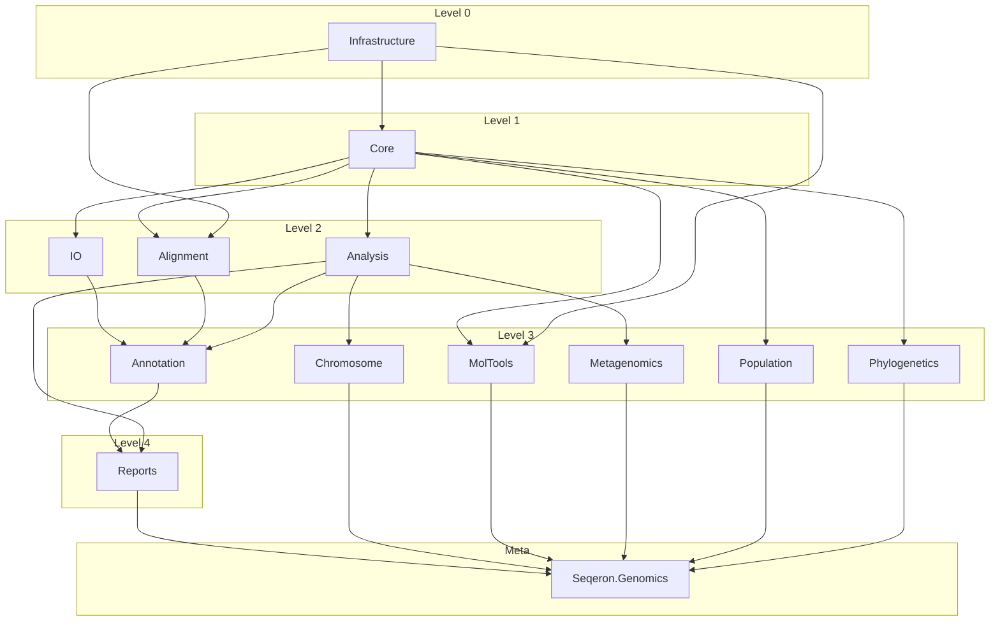

# Seqeron Bioinformatics

> ⚠️ **EARLY ALPHA — NOT FOR PRODUCTION USE**
>
> This library is in **early alpha stage** and is under active development. While we strive for correctness and have extensive test coverage, the APIs, algorithms, and outputs **have not been independently validated** for use in clinical, diagnostic, or production research settings.
>
> **Before using this library with real data or in real-world applications:**
> - Independently verify all algorithm outputs against established tools
> - Conduct thorough validation for your specific use case
> - Do not use for clinical decision-making without proper validation
>
> **Disclaimer:** The authors and contributors make no warranties regarding the correctness, reliability, or fitness for any particular purpose. Use at your own risk. The authors shall not be liable for any damages, losses, or harm arising from the use or misuse of this software.
>
> **Contributions welcome:** We actively encourage independent audits, bug reports, and corrections. If you find an error in any algorithm implementation, please [open an issue](https://github.com/your-repo/issues) or submit a pull request. Community review is essential for improving reliability.
>
> See [LICENSE](LICENSE) for full terms.

C#/.NET 8 toolkit for bioinformatics: sequence models, core algorithms, and file-format parsers. A primary integration path is MCP (Model Context Protocol) servers that expose the APIs as tools for AI/agent workflows.

[](https://dotnet.microsoft.com/)
[](LICENSE)

## Quickstart (Library)

```csharp
using Seqeron.Genomics;

var dna = new DnaSequence("AAAGAATTCAAA");

Console.WriteLine($"Length: {dna.Length}");
Console.WriteLine($"GC%: {dna.GcContent():F2}");
Console.WriteLine($"RevComp: {dna.ReverseComplement()}");

// Fast motif lookup via suffix tree
bool hasEcoRI = dna.SuffixTree.Contains("GAATTC");
Console.WriteLine($"EcoRI site: {hasEcoRI}");
```

Validation-friendly path:

```csharp
using Seqeron.Genomics;

if (!DnaSequence.TryCreate("ACGTNN", out var seq))
{
    Console.WriteLine("Invalid DNA sequence");
}
else
{
    Console.WriteLine(seq.GcContent());
}
```

## MCP Integration (Recommended)

**LLM‑native bioinformatics.** MCP lets your LLM call Seqeron tools with strict schemas and reproducible outputs.

**Start here:** [What is MCP](docs/mcp/README.md#what-is-mcp) · [What you get in practice](docs/mcp/README.md#what-you-get-in-practice) · [How to connect](docs/mcp/README.md#how-to-connect-a-server-to-your-llm-tool) · [How to use](docs/mcp/README.md#how-to-use-in-practice) · [Why servers are split](docs/mcp/README.md#servers-in-this-repo-and-why-split) · [Connect to Codex](docs/mcp/README.md#connect-to-codex-cli-or-ide)

### Example (real workflow): cloning insert QC

**Task:** given an insert in FASTA, report GC% and whether it contains EcoRI (GAATTC) or BamHI (GGATCC) sites (0‑based positions).
This is a standard cloning QC step to avoid cutting sites and to estimate PCR behavior.

**User prompt (in your LLM chat):**

```
Use tools only; no manual parsing or calculations, and no code or command execution.
I have a cloning insert in FASTA below. Please read the sequence from the FASTA using tools (do not interpret FASTA manually),
then check GC% (report with 2 decimals)
and whether it contains EcoRI (GAATTC) or BamHI (GGATCC) sites (report positions as 0-based).
Return a Markdown table with columns: id, length, gc_percent, EcoRI_sites, BamHI_sites,
using this exact header and separator:
| id | length | gc_percent | EcoRI_sites | BamHI_sites |
|---|---:|---:|---|---|
Format EcoRI_sites and BamHI_sites as JSON arrays (e.g., [4] or []).
Output only the table, no extra commentary.

>seq1
GCGCGAATTCATGGATCCATAT
```

**LLM result:**

```
| id | length | gc_percent | EcoRI_sites | BamHI_sites |
|---|---:|---:|---|---|
| seq1 | 22 | 45.45 | [4] | [12] |
```

**Tools used (in order):**
1) `fasta_parse` → sequence = "GCGCGAATTCATGGATCCATAT"
2) `gc_content` → gcContent = 45.45, gcCount = 10, totalCount = 22
3) `suffix_tree_find_all` (pattern = "GAATTC") → positions = [4]
4) `suffix_tree_find_all` (pattern = "GGATCC") → positions = [12]

Tool schemas and examples: [Core](docs/mcp/tools/core), [Sequence](docs/mcp/tools/sequence), [Parsers](docs/mcp/tools/parsers).

### Example (real workflow): PCR primer QC

**Task:** validate primer sequences, compute GC% and Tm, and report the Tm difference.
This is a routine pre‑screen for primer pairs before PCR.

**User prompt (in your LLM chat):**

```
Use tools only; no manual parsing or calculations, and no code or command execution.
These are PCR primers in FASTA below. Please read the sequences from the FASTA using tools (do not interpret FASTA manually),
confirm each primer is valid DNA (A/C/G/T only), report GC% (2 decimals) and Tm in °C (1 decimal), and the Tm difference for the pair.

>FWD
ATGCGATCGATCGATCGTAG
>REV
GCGCGATCGATCGATCGCAA

Return a Markdown table with columns: id, length, gc_percent, tm_c,
using this exact header and separator:
| id | length | gc_percent | tm_c |
|---|---:|---:|---:|
Then add a blank line and one line: tm_diff_c = |Tm_FWD - Tm_REV| (1 decimal).
Output only the table and tm_diff line, no extra commentary.
```

**LLM result:**

```
| id | length | gc_percent | tm_c |
|---|---:|---:|---:|
| FWD | 20 | 50.00 | 51.8 |
| REV | 20 | 60.00 | 55.9 |

tm_diff_c = 4.1
```

**Tools used (in order):**
1) `fasta_parse` → sequences for FWD/REV
2) `dna_validate` (FWD) → valid, length = 20
3) `dna_validate` (REV) → valid, length = 20
4) `gc_content` (FWD) → 50.00%
5) `gc_content` (REV) → 60.00%
6) `melting_temperature` (FWD) → 51.8°C
7) `melting_temperature` (REV) → 55.9°C

## What’s Inside

- DNA/RNA/Protein models with validation and common operations.
- Algorithms: pattern matching, k-mer analysis, repeat analysis, annotation, molecular tools.
- Parsers/writers for genomics formats (FASTA/FASTQ/GenBank/GFF/VCF/BED/EMBL).
- Suffix tree implementation for fast substring queries.
- MCP servers for Core, Sequence, and Parsers toolsets.
- Benchmarks, stress harness, and extensive unit tests.

## Repository Layout

```
Seqeron.sln
src/
├── SuffixTree/                         # Suffix tree implementation
├── Seqeron/
│   ├── Seqeron.Genomics/               # Meta-package (aggregates all modules)
│   ├── Seqeron.Genomics.Infrastructure/# Base types (StatisticsHelper, AlignmentTypes)
│   ├── Seqeron.Genomics.Core/          # Sequence models (DNA, RNA, Protein)
│   ├── Seqeron.Genomics.IO/            # Format parsers (FASTA, GenBank, VCF, etc.)
│   ├── Seqeron.Genomics.Alignment/     # Sequence alignment algorithms
│   ├── Seqeron.Genomics.Analysis/      # K-mer, motif, repeat analysis
│   ├── Seqeron.Genomics.Annotation/    # Genome annotation, variant calling
│   ├── Seqeron.Genomics.Phylogenetics/ # Phylogenetic analysis
│   ├── Seqeron.Genomics.Population/    # Population genetics
│   ├── Seqeron.Genomics.Metagenomics/  # Metagenomic analysis
│   ├── Seqeron.Genomics.MolTools/      # Molecular tools (primers, CRISPR, etc.)
│   ├── Seqeron.Genomics.Chromosome/    # Chromosome-level analysis
│   ├── Seqeron.Genomics.Reports/       # Report generation
│   ├── Seqeron.Mcp.Sequence/           # MCP server: sequence analysis tools
│   └── Seqeron.Mcp.Parsers/            # MCP server: parser and format tools
tests/
├── SuffixTree.Tests/                   # Suffix tree tests
├── Seqeron.Genomics.Tests/             # Genomics tests
├── Seqeron.Mcp.Sequence.Tests/         # MCP sequence tool tests
└── Seqeron.Mcp.Parsers.Tests/          # MCP parser tool tests
apps/
├── SuffixTree.Benchmarks/              # Benchmarks
└── SuffixTree.Console/                 # Stress and verification harness
docs/                                   # Documentation
```

## Package Dependencies



## Documentation

### For Study

- Start here: [Algorithms index](docs/algorithms/README.md).
- Algorithm areas: [Annotation](docs/algorithms/Annotation), [K-mer Analysis](docs/algorithms/K-mer_Analysis), [Pattern Matching](docs/algorithms/Pattern_Matching), [Repeat Analysis](docs/algorithms/Repeat_Analysis), [Sequence Composition](docs/algorithms/Sequence_Composition), [Molecular Tools](docs/algorithms/Molecular_Tools), [MolTools](docs/algorithms/MolTools).
- Suffix tree algorithm: [Suffix Tree (Ukkonen)](docs/algorithms/Pattern_Matching/Suffix_Tree.md).

### For Development

- MCP guide: [docs/mcp/README.md](docs/mcp/README.md).
- MCP tool docs: [Core](docs/mcp/tools/core), [Sequence](docs/mcp/tools/sequence), [Parsers](docs/mcp/tools/parsers).
- MCP traceability: [docs/mcp/traceability.md](docs/mcp/traceability.md).
- Algorithm test specifications: [TestSpecs](TestSpecs).

## Build and Test

```bash
dotnet build
dotnet test
```

## Performance & NativeAOT

### NativeAOT Optimization

All library and executable projects are configured for aggressive NativeAOT compilation.

**Libraries** (`SuffixTree.Core`, `SuffixTree`, `SuffixTree.Persistent`):

```xml
<IsAotCompatible>true</IsAotCompatible>   <!-- Warnings if AOT-incompatible code -->
<IsTrimmable>true</IsTrimmable>           <!-- Dead code elimination -->
```

**Executables** (`SuffixTree.Console`, `SuffixTree.Mcp.Core`, `Seqeron.Mcp.Parsers`, `Seqeron.Mcp.Sequence`):

```xml
<PublishAot>true</PublishAot>               <!-- Full native compilation, no JIT/CLR -->
<OptimizationPreference>Speed</OptimizationPreference> <!-- Aggressive inlining, loop unrolling -->
<IlcInstructionSet>native</IlcInstructionSet>          <!-- AVX2/SSE4.2/BMI2/POPCNT for current CPU -->
<IlcFoldIdenticalMethodBodies>true</IlcFoldIdenticalMethodBodies> <!-- Dedup generic instantiations -->
<StripSymbols>true</StripSymbols>           <!-- Remove debug symbols from binary -->
<InvariantGlobalization>true</InvariantGlobalization>   <!-- Drop ICU (~30 MB); bioinformatics doesn't need culture -->
```

**Publish** (requires [Desktop Development with C++](https://aka.ms/nativeaot-prerequisites) workload in Visual Studio):

```bash
dotnet publish -c Release -r win-x64
```

| Flag | Effect |
|:-----|:-------|
| `PublishAot` | Full AOT compilation to native code, no JIT/CLR at runtime |
| `OptimizationPreference=Speed` | Aggressive inlining, loop unrolling (vs `Size`) |
| `IlcInstructionSet=native` | Emits AVX2/SSE4.2/BMI2/POPCNT/LZCNT for the build machine CPU |
| `IlcFoldIdenticalMethodBodies` | Deduplicates identical generic method instantiations |
| `StripSymbols` | Strips debug symbols from the final binary |
| `InvariantGlobalization` | Removes ICU globalization data (~30 MB savings) |
| `IsAotCompatible` | Build-time warnings for AOT-incompatible patterns |
| `IsTrimmable` | Enables IL trimming for unused code |

### Benchmarks

The benchmark project uses a **two-phase strategy** to avoid the common pitfall of BenchmarkDotNet re-compiling AOT for every benchmark method (which causes multi-hour "freezes"):

#### Phase 1 — JIT Baseline (~3 min)

```bash
dotnet run --project apps/SuffixTree.Benchmarks -c Release -f net9.0 -- \
  --filter "*Build_Short*" "*Build_DNA*" "*Contains*" "*LRS*" \
  --iterationCount 3 --warmupCount 1
```

#### Phase 2 — Publish NativeAOT Once (~5 min)

```bash
dotnet publish apps/SuffixTree.Benchmarks -c Release -r win-x64 -f net9.0 \
  /p:PublishAot=true /p:OptimizationPreference=Speed \
  /p:IlcInstructionSet=native /p:IlcFoldIdenticalMethodBodies=true \
  /p:StripSymbols=true /p:InvariantGlobalization=true
```

#### Phase 3 — Run AOT Binary with InProcess Toolchain (~3 min)

```bash
./apps/SuffixTree.Benchmarks/bin/Release/net9.0/win-x64/publish/SuffixTree.Benchmarks.exe \
  --inprocess --filter "*Build_Short*" "*Build_DNA*" "*Contains*" "*LRS*"
```

The `--inprocess` flag uses `InProcessNoEmitToolchain` — the pre-compiled AOT binary benchmarks itself without spawning child processes or re-compilation.

#### JIT Baseline Results (.NET 9.0, RyuJIT x86-64-v4)

> 11th Gen Intel Core i7-1185G7, 4 cores / 8 threads, AVX-512

| Method | Mean | Allocated |
|:-------|-----:|----------:|
| LRS_Short | 21.2 ns | 32 B |
| LRS_DNA | 23.5 ns | 56 B |
| Contains_Short | 43.8 ns | 0 B |
| Contains_DNA | 107.4 ns | 0 B |
| Build_Short | 18.3 µs | 19 KB |
| Build_DNA (50K) | 50.7 ms | 8.5 MB |

## License

See [LICENSE](LICENSE).
