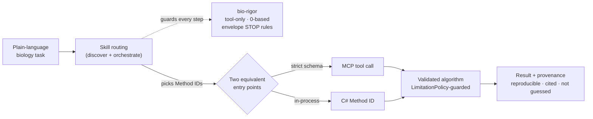
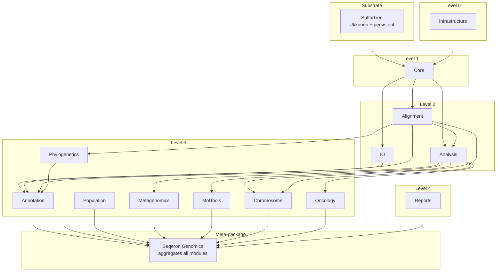

# Seqeron Bioinformatics

> ⚠️ **PRE-RELEASE (ALPHA) — NOT YET CERTIFIED FOR CLINICAL OR DIAGNOSTIC USE**
>
> This library is pre-1.0 and under active development. Public APIs may change between releases.
>
> **What has been done (verifiable in this repo):**
> - Extensive automated testing — **22,290 executed test cases** (13,551 `[Test]` methods plus parametrized `[TestCase]`/combinatorial expansions) across 1,173 fixtures (~3.8× more test code than product code), covering 258 algorithm units, plus 27 opt-in performance/benchmark tests run on demand. Full solution suite green on .NET 10.
> - Ten complementary test methodologies — property-based, metamorphic, fuzzing, mutation, snapshot, algebraic, architecture, differential, combinatorial, and characterization testing (see [docs/checklists](docs/checklists)).
> - An internal, per-unit **independent validation campaign** with a documented findings register, a published limitations/operating-envelope document, and a runtime `LimitationPolicy` that guards algorithms used outside their validated scope (see [docs/Validation](docs/Validation)).
> - Algorithm parameters and coefficients reproduced from primary literature and reference implementations, tracked per unit.
>
> **What has *not* been done — and why you must still validate before relying on it:**
> - No **third-party / external** audit, peer review, or regulatory clearance.
> - No certification for clinical, diagnostic, or decision-making use.
> - Many algorithms are faithful but **simplified or subset** realisations of fuller published methods; their honest scope is documented in [LIMITATIONS.md](docs/Validation/LIMITATIONS.md).
>
> **Before using with real data or in production:**
> - Independently verify all outputs against established tools for your specific use case.
> - Do not use for clinical or diagnostic decision-making without your own qualification and validation.
>
> **Disclaimer:** The authors and contributors make no warranties regarding correctness, reliability, or fitness for any particular purpose. Use at your own risk. The authors shall not be liable for any damages, losses, or harm arising from the use or misuse of this software.
>
> **Contributions welcome:** We actively encourage independent audits, bug reports, and corrections. If you find an error in any algorithm implementation, please open an issue or submit a pull request — external review is exactly what would move this project past its current, self-validated state.
>
> See [LICENSE](LICENSE) for full terms.

C#/.NET toolkit for bioinformatics (.NET 10): sequence models, core algorithms, and file-format parsers. A primary integration path is MCP (Model Context Protocol) servers that expose the APIs as tools for AI/agent workflows.

[](https://dotnet.microsoft.com/)
[](LICENSE)

## Get started in one command

Clone the repo, open it in **Claude Code** (or GitHub Copilot / VS Code), and just ask:

> **install and configure**

That triggers the [`seqeron-setup`](.claude/skills/seqeron-setup) skill, which checks your
toolchain (.NET 10 SDK + Python 3), builds all 11 MCP servers, and runs a live smoke test.
Or run the same thing directly:

```bash
scripts/setup.sh          # build everything + verify the on-demand tool path
```

### Your first task

After setup, **describe a biology task in plain language.** No tool picking, no code — the
matching skills load themselves and chain the real, validated algorithms. For example:

> *"Here are two versions of a short gene fragment — a drug-susceptible wild type and a clinical
> isolate we suspect carries a resistance mutation. Confirm both are clean DNA, tell me exactly
> what changed and whether it alters the protein, and if it does, design me a PCR primer pair to
> amplify the region for a diagnostic."* (with the two FASTA sequences)

The assistant routes it through a chain of skills — **every number below is computed by the
library, none guessed:**

1. **[`bio-qc`](.claude/skills/bio-qc)** — both are valid DNA, 57 bp; GC 49.12 % vs 50.88 %.
2. **[`bio-alignment`](.claude/skills/bio-alignment)** — **98.25 % identical**, a single substitution (no indels): **T→G at position 15** (0-based).
3. **[`bio-annotation`](.claude/skills/bio-annotation)** — translating the reading frame, `…MTEAR·`**`W`**`·DLK…` → `…MTEAR·`**`G`**`·DLK…`: a **missense mutation, `p.Trp6Gly`** — it really does change the protein.
4. **[`bio-moldesign`](.claude/skills/bio-moldesign)** — a validated PCR pair around the site (61 bp amplicon): both primers **Tm ≈ 58.7 °C** (ΔTm 0.2 °C), no hairpin — ready for the bench.

[`bio-rigor`](.claude/skills/bio-rigor) runs throughout (tool-only, 0-based coordinates, provenance).

No MCP registration and no schema wrangling: the [skills](#skills-claude-code--github-copilot)
call the shipped servers **on demand**, pulling in only the tools a task needs, so the 427 tool
schemas never flood the model's context. Setup is a one-time step per clone; re-run it any time a
build looks stale (it's idempotent). More worked end-to-end tasks: [`docs/skills/golden/`](docs/skills/golden).

## Quickstart (Library)

```csharp
using Seqeron.Genomics;

var dna = new DnaSequence("AAAGAATTCAAA");

Console.WriteLine($"Length: {dna.Length}");
Console.WriteLine($"GC%: {dna.GcContent():F2}");
Console.WriteLine($"RevComp: {dna.ReverseComplement()}");

// Fast motif lookup via suffix tree
bool hasEcoRI = dna.SuffixTree.Contains("GAATTC");
Console.WriteLine($"EcoRI site: {hasEcoRI}");
```

Validation-friendly path:

```csharp
using Seqeron.Genomics;

if (!DnaSequence.TryCreate("ACGTNN", out var seq))
{
    Console.WriteLine("Invalid DNA sequence");
}
else
{
    Console.WriteLine(seq.GcContent());
}
```

## MCP Integration (Recommended)

**LLM‑native bioinformatics.** MCP lets your LLM call Seqeron tools with strict schemas and reproducible outputs.

**Start here:** [What is MCP](docs/mcp/README.md#what-is-mcp) · [What you get in practice](docs/mcp/README.md#what-you-get-in-practice) · [How to connect](docs/mcp/README.md#how-to-connect-a-server-to-your-llm-tool) · [How to use](docs/mcp/README.md#how-to-use-in-practice) · [Why servers are split](docs/mcp/README.md#servers-in-this-repo-and-why-split) · [Connect to Codex](docs/mcp/README.md#connect-to-codex-cli-or-ide)

### Example (real workflow): cloning insert QC

**Task:** given an insert in FASTA, report GC% and whether it contains EcoRI (GAATTC) or BamHI (GGATCC) sites (0‑based positions).
This is a standard cloning QC step to avoid cutting sites and to estimate PCR behavior.

**User prompt (in your LLM chat):**

```
Use tools only; no manual parsing or calculations, and no code or command execution.
I have a cloning insert in FASTA below. Please read the sequence from the FASTA using tools (do not interpret FASTA manually),
then check GC% (report with 2 decimals)
and whether it contains EcoRI (GAATTC) or BamHI (GGATCC) sites (report positions as 0-based).
Return a Markdown table with columns: id, length, gc_percent, EcoRI_sites, BamHI_sites,
using this exact header and separator:
| id | length | gc_percent | EcoRI_sites | BamHI_sites |
|---|---:|---:|---|---|
Format EcoRI_sites and BamHI_sites as JSON arrays (e.g., [4] or []).
Output only the table, no extra commentary.

>seq1
GCGCGAATTCATGGATCCATAT
```

**LLM result:**

```
| id | length | gc_percent | EcoRI_sites | BamHI_sites |
|---|---:|---:|---|---|
| seq1 | 22 | 45.45 | [4] | [12] |
```

**Tools used (in order):**
1) `fasta_parse` → sequence = "GCGCGAATTCATGGATCCATAT"
2) `gc_content` → gcContent = 45.45, gcCount = 10, totalCount = 22
3) `suffix_tree_find_all` (pattern = "GAATTC") → positions = [4]
4) `suffix_tree_find_all` (pattern = "GGATCC") → positions = [12]

Tool schemas and examples: [Core](docs/mcp/tools/core), [Sequence](docs/mcp/tools/sequence), [Parsers](docs/mcp/tools/parsers).

### Example (real workflow): PCR primer QC

**Task:** validate primer sequences, compute GC% and Tm, and report the Tm difference.
This is a routine pre‑screen for primer pairs before PCR.

**User prompt (in your LLM chat):**

```
Use tools only; no manual parsing or calculations, and no code or command execution.
These are PCR primers in FASTA below. Please read the sequences from the FASTA using tools (do not interpret FASTA manually),
confirm each primer is valid DNA (A/C/G/T only), report GC% (2 decimals) and Tm in °C (1 decimal), and the Tm difference for the pair.

>FWD
ATGCGATCGATCGATCGTAG
>REV
GCGCGATCGATCGATCGCAA

Return a Markdown table with columns: id, length, gc_percent, tm_c,
using this exact header and separator:
| id | length | gc_percent | tm_c |
|---|---:|---:|---:|
Then add a blank line and one line: tm_diff_c = |Tm_FWD - Tm_REV| (1 decimal).
Output only the table and tm_diff line, no extra commentary.
```

**LLM result:**

```
| id | length | gc_percent | tm_c |
|---|---:|---:|---:|
| FWD | 20 | 50.00 | 51.8 |
| REV | 20 | 60.00 | 55.9 |

tm_diff_c = 4.1
```

**Tools used (in order):**
1) `fasta_parse` → sequences for FWD/REV
2) `dna_validate` (FWD) → valid, length = 20
3) `dna_validate` (REV) → valid, length = 20
4) `gc_content` (FWD) → 50.00%
5) `gc_content` (REV) → 60.00%
6) `melting_temperature` (FWD) → 51.8°C
7) `melting_temperature` (REV) → 55.9°C

## Skills (Claude Code / GitHub Copilot)

**A thin routing + discipline layer that turns the library into an agent that solves whole biological tasks** — not just single tool calls. The [Agent Skills](https://docs.anthropic.com/en/docs/claude-code/skills) live under [`.claude/skills/`](.claude/skills) (Claude Code) and a byte‑identical mirror under [`.github/skills/`](.github/skills) (Copilot / VS Code).

**Why it matters.** With **427 tools** an LLM drowns if you attach every schema. The skills keep tool descriptions **out of the model’s context** and instead teach it to: **discover** the right tool, **orchestrate** a correct multi‑step pipeline, and stay **scientifically honest** (compute with tools — never guess; respect each algorithm’s validated envelope; carry provenance). Every recipe is **dual‑mode** — it works whether you call the **MCP tool** or the equivalent **C# `Method ID`** — so you don’t need MCP at all; the algorithms are the same either way.

**The 21 skills.**

- **Cross‑cutting:** `seqeron-setup` (one-command install & configuration for a fresh clone) · `seqeron-discovery` (find the right tool among 427 without loading schemas) · `bio-rigor` (tool‑only computation, provenance, envelope STOP rules) · `seqeron-dev` (the C# API path: namespaces, `LimitationPolicy`, `TryCreate`) · `seqeron-python-client` (wrap any tool in a small Python script).
- **Domains:** `bio-qc` · `bio-alignment` · `bio-assembly` · `bio-annotation` · `bio-moldesign` · `bio-phylo-popgen` · `bio-metagenomics` · `bio-chromosome` · `seqeron-rna-structure` · `seqeron-protein-features` · `seqeron-transcriptome` · `seqeron-epigenetics` · `seqeron-comparative-genomics` · `seqeron-oncology` · `seqeron-mirna` · `seqeron-structural-variants`.

An [auto‑generated catalog](docs/skills/_generated) + a CI guardrail keep the skills in sync with the tools (no drift). Plan of record: [`docs/skills/STRATEGY.md`](docs/skills/STRATEGY.md); worked regression tasks: [`docs/skills/golden/`](docs/skills/golden).

For a worked end-to-end example (the resistance-mutation chain — QC → alignment → variant effect → primer design, every number computed by the library), see [**Your first task**](#your-first-task) above, and [`docs/skills/golden/`](docs/skills/golden) for more.

> **How the compute happens:** the skills only tell the assistant *which* `Method ID`s to call; the numbers come from the real library (run directly via the C# API, or over MCP). The tool schemas never enter the model’s context.

**How a task flows** — the same validated algorithm answers whether you go through MCP or the C# API:


```mermaid
flowchart LR
    U["Plain-language<br/>biology task"] --> SK["Skill routing<br/>(discover + orchestrate)"]
    SK -.->|"guards every step"| RIG["bio-rigor<br/>tool-only · 0-based<br/>envelope STOP rules"]
    SK -->|"picks Method IDs"| P{"Two equivalent<br/>entry points"}
    P -->|"strict schema"| MCP["MCP tool call"]
    P -->|"in-process"| API["C# Method ID"]
    MCP --> ALG["Validated algorithm<br/>LimitationPolicy-guarded"]
    API --> ALG
    ALG --> OUT["Result + provenance<br/>reproducible · cited · not guessed"]
```

## What’s Inside

- DNA/RNA/Protein sequence models with validation and common operations.
- Parsers/writers for common genomics formats (FASTA/FASTQ/GenBank/GFF/VCF/BED/EMBL).
- A broad algorithm library spanning alignment, k-mer/motif/repeat/complexity analysis, annotation and variant calling, phylogenetics, population genetics, metagenomics, comparative and structural genomics, transcriptome and translation, RNA secondary structure, epigenetics, oncology, chromosome-level analysis, and molecular tools (primer/probe/CRISPR design, codon optimization, restriction analysis).
- High-performance suffix tree (Ukkonen) for fast substring queries, plus a persistent on-disk variant.
- MCP servers exposing the toolsets to LLM/agent workflows — one per domain (sequence, parsers, alignment, analysis, annotation, phylogenetics, population, metagenomics, chromosome, molecular tools) plus the core suffix-tree server.
- Evidence-based validation: algorithm parameters and coefficients reproduced from primary literature and reference implementations, tracked under [docs/Validation](docs/Validation) (235 test-spec units).
- Benchmarks, stress harness, and extensive unit tests (22,290 cases, warnings-as-errors, CI-gated). Targets .NET 10.

## Repository Layout

```
Seqeron.sln
Directory.Build.props                   # Solution-wide build defaults (net10.0, nullable, warnings-as-errors, deterministic)
Directory.Packages.props                # Central Package Management — every NuGet version pinned in one place
.editorconfig                           # Shared formatting / code-style baseline
.github/workflows/dotnet.yml            # CI: restore → build (warnings-as-errors) → full test suite
src/
├── SuffixTree/
│   ├── Algorithms/                     # Suffix tree implementation
│   └── Mcp/                            # MCP server: core suffix-tree tools
├── Seqeron/
│   ├── Algorithms/
│   │   ├── Seqeron.Genomics/               # Meta-package (aggregates all modules)
│   │   ├── Seqeron.Genomics.Infrastructure/# Base types (StatisticsHelper, AlignmentTypes)
│   │   ├── Seqeron.Genomics.Core/          # Sequence models (DNA, RNA, Protein)
│   │   ├── Seqeron.Genomics.IO/            # Format parsers (FASTA, GenBank, VCF, etc.)
│   │   ├── Seqeron.Genomics.Alignment/     # Sequence alignment algorithms
│   │   ├── Seqeron.Genomics.Analysis/      # K-mer, motif, repeat analysis
│   │   ├── Seqeron.Genomics.Annotation/    # Genome annotation, variant calling
│   │   ├── Seqeron.Genomics.Phylogenetics/ # Phylogenetic analysis
│   │   ├── Seqeron.Genomics.Population/    # Population genetics
│   │   ├── Seqeron.Genomics.Metagenomics/  # Metagenomic analysis
│   │   ├── Seqeron.Genomics.MolTools/      # Molecular tools (primers, probes, CRISPR, codon opt.)
│   │   ├── Seqeron.Genomics.Chromosome/    # Chromosome-level analysis
│   │   ├── Seqeron.Genomics.Oncology/      # Cancer genomics (CNV, drivers, clonality) — partial classes by sub-domain
│   │   └── Seqeron.Genomics.Reports/       # Report generation
│   └── Mcp/                            # MCP servers, one per domain:
│       ├── Seqeron.Mcp.Sequence/           #   sequence analysis tools
│       ├── Seqeron.Mcp.Parsers/            #   parser and format tools
│       ├── Seqeron.Mcp.Alignment/          #   alignment tools
│       ├── Seqeron.Mcp.Analysis/           #   k-mer / motif / repeat tools
│       ├── Seqeron.Mcp.Annotation/         #   annotation tools
│       ├── Seqeron.Mcp.Phylogenetics/      #   phylogenetics tools
│       ├── Seqeron.Mcp.Population/          #   population-genetics tools
│       ├── Seqeron.Mcp.Metagenomics/       #   metagenomics tools
│       ├── Seqeron.Mcp.Chromosome/         #   chromosome tools
│       └── Seqeron.Mcp.MolTools/           #   molecular-tools
tests/
├── SuffixTree/
│   ├── SuffixTree.Tests/               # Suffix tree tests
│   ├── SuffixTree.Persistent.Tests/    # Persistent suffix-tree tests
│   └── SuffixTree.Mcp.Core.Tests/      # MCP core tool tests
└── Seqeron/
    ├── Seqeron.Genomics.Tests/         # Genomics algorithm tests (the bulk of the suite)
    └── Seqeron.Mcp.*.Tests/            # Per-domain MCP server tests
apps/
├── SuffixTree.Benchmarks/              # Benchmarks
├── SuffixTree.Console/                 # Stress and verification harness
└── SuffixTree.GenomeDemo/              # Chr1 MMF demo and profiling
docs/                                   # Documentation
```

## Package Dependencies

The library is a strictly layered set of packages — dependencies only ever point *up* the
levels, never sideways within a level or downward (enforced by the architecture tests). An arrow
`A --> B` means **B depends on A**. Every module also references `Core` + `Infrastructure`
(Levels 0–1); those universal edges are drawn only where they define the layer, to keep the graph
readable. `Reports` and `Population` depend on nothing beyond `Core` + `Infrastructure`.


```mermaid
graph TD
    subgraph "Substrate"
        ST[SuffixTree<br/>Ukkonen + persistent]
    end
    subgraph "Level 0"
        INF[Infrastructure]
    end
    subgraph "Level 1"
        CORE[Core]
    end
    subgraph "Level 2"
        IO[IO]
        ALN[Alignment]
        ANA[Analysis]
    end
    subgraph "Level 3"
        ANN[Annotation]
        PHY[Phylogenetics]
        POP[Population]
        META[Metagenomics]
        MOL[MolTools]
        CHR[Chromosome]
        ONC[Oncology]
    end
    subgraph "Level 4"
        REP[Reports]
    end
    subgraph "Meta-package"
        GEN[Seqeron.Genomics<br/>aggregates all modules]
    end

    ST --> CORE
    INF --> CORE
    CORE --> IO
    CORE --> ALN
    CORE --> ANA
    ALN --> ANA

    ALN --> PHY
    ANA --> META
    ANA --> MOL
    ANA --> ONC
    ALN --> CHR
    ANA --> CHR
    IO --> ANN
    ALN --> ANN
    ANA --> ANN
    PHY --> ANN

    ANN --> GEN
    PHY --> GEN
    POP --> GEN
    META --> GEN
    MOL --> GEN
    CHR --> GEN
    ONC --> GEN
    REP --> GEN
```

## Documentation

### For Study

- Start here: [Algorithms index](docs/algorithms/README.md).
- Algorithm areas: [Annotation](docs/algorithms/Annotation), [K-mer Analysis](docs/algorithms/K-mer), [Pattern Matching](docs/algorithms/Pattern_Matching), [Repeat Analysis](docs/algorithms/Repeat_Analysis), [Sequence Composition](docs/algorithms/Sequence_Composition), [MolTools](docs/algorithms/MolTools).
- Suffix tree algorithm: [Suffix Tree (Ukkonen)](docs/algorithms/Pattern_Matching/Suffix_Tree.md).

### For Development

- MCP guide: [docs/mcp/README.md](docs/mcp/README.md).
- MCP tool docs: [Core](docs/mcp/tools/core), [Sequence](docs/mcp/tools/sequence), [Parsers](docs/mcp/tools/parsers).
- MCP traceability: [docs/mcp/traceability.md](docs/mcp/traceability.md).
- Skills strategy & catalog: [docs/skills/STRATEGY.md](docs/skills/STRATEGY.md), [docs/skills/golden](docs/skills/golden).
- Algorithm test specifications: [tests/TestSpecs](tests/TestSpecs).

## Build and Test

```bash
dotnet build          # Release build; warnings are errors on every project
dotnet test           # full suite — 22,290 cases across 14 assemblies
```

**Build & quality gates.** Versions and shared build settings are centralized so all 46 projects
stay consistent:

- **[Central Package Management](Directory.Packages.props)** — every NuGet version is declared once; project files carry no `Version` attributes.
- **[`Directory.Build.props`](Directory.Build.props)** — one place for `net10.0`, nullable, implicit usings, deterministic builds, and `TreatWarningsAsErrors` (applied to *every* project).
- **CI** — [`.github/workflows/dotnet.yml`](.github/workflows/dotnet.yml) restores, builds (warnings-as-errors), and runs the full suite on every push/PR.

Wall-clock **performance / benchmark** tests are marked `[Explicit]` so they never flake the
parallel gate; run them on demand:

```bash
dotnet test --filter "TestCategory=Performance"     # opt-in timing / complexity guards
```

## Performance & NativeAOT

### NativeAOT Optimization

Performance-critical libraries and executables are configured for aggressive NativeAOT compilation.

**Libraries** (`SuffixTree.Core`, `SuffixTree`, `SuffixTree.Persistent`):

```xml
<IsAotCompatible>true</IsAotCompatible>   <!-- Warnings if AOT-incompatible code -->
<IsTrimmable>true</IsTrimmable>           <!-- Dead code elimination -->
```

**Executables** (all MCP servers — `Seqeron.Mcp.*` and `SuffixTree.Mcp.Core` — plus the `SuffixTree.Console` harness):

```xml
<PublishAot>true</PublishAot>               <!-- Full native compilation, no JIT/CLR -->
<OptimizationPreference>Speed</OptimizationPreference> <!-- Aggressive inlining, loop unrolling -->
<IlcInstructionSet>native</IlcInstructionSet>          <!-- AVX2/SSE4.2/BMI2/POPCNT for current CPU -->
<IlcFoldIdenticalMethodBodies>true</IlcFoldIdenticalMethodBodies> <!-- Dedup generic instantiations -->
<StripSymbols>true</StripSymbols>           <!-- Remove debug symbols from binary -->
<InvariantGlobalization>true</InvariantGlobalization>   <!-- Drop ICU (~30 MB); bioinformatics doesn't need culture -->
```

**Publish** (requires [Desktop Development with C++](https://aka.ms/nativeaot-prerequisites) workload in Visual Studio):

```bash
dotnet publish -c Release -r win-x64
```

| Flag | Effect |
|:-----|:-------|
| `PublishAot` | Full AOT compilation to native code, no JIT/CLR at runtime |
| `OptimizationPreference=Speed` | Aggressive inlining, loop unrolling (vs `Size`) |
| `IlcInstructionSet=native` | Emits AVX2/SSE4.2/BMI2/POPCNT/LZCNT for the build machine CPU |
| `IlcFoldIdenticalMethodBodies` | Deduplicates identical generic method instantiations |
| `StripSymbols` | Strips debug symbols from the final binary |
| `InvariantGlobalization` | Removes ICU globalization data (~30 MB savings) |
| `IsAotCompatible` | Build-time warnings for AOT-incompatible patterns |
| `IsTrimmable` | Enables IL trimming for unused code |

### Benchmarks

The benchmark project uses a **two-phase strategy** to avoid the common pitfall of BenchmarkDotNet re-compiling AOT for every benchmark method (which causes multi-hour "freezes"):

#### Phase 1 — JIT Baseline (~3 min)

```bash
dotnet run --project apps/SuffixTree.Benchmarks -c Release -f net10.0 -- \
  --filter "*Build_Short*" "*Build_DNA*" "*Contains*" "*LRS*" \
  --iterationCount 3 --warmupCount 1
```

#### Phase 2 — Publish NativeAOT Once (~5 min)

```bash
dotnet publish apps/SuffixTree.Benchmarks -c Release -r win-x64 -f net10.0 \
  /p:PublishAot=true /p:OptimizationPreference=Speed \
  /p:IlcInstructionSet=native /p:IlcFoldIdenticalMethodBodies=true \
  /p:StripSymbols=true /p:InvariantGlobalization=true
```

#### Phase 3 — Run AOT Binary with InProcess Toolchain (~3 min)

```bash
./apps/SuffixTree.Benchmarks/bin/Release/net10.0/win-x64/publish/SuffixTree.Benchmarks.exe \
  --inprocess --filter "*Build_Short*" "*Build_DNA*" "*Contains*" "*LRS*"
```

The `--inprocess` flag uses `InProcessNoEmitToolchain` — the pre-compiled AOT binary benchmarks itself without spawning child processes or re-compilation.

#### JIT Baseline Results (.NET 9.0, RyuJIT x86-64-v4)

> 11th Gen Intel Core i7-1185G7, 4 cores / 8 threads, AVX-512

| Method | Mean | Allocated |
|:-------|-----:|----------:|
| LRS_Short | 21.2 ns | 32 B |
| LRS_DNA | 23.5 ns | 56 B |
| Contains_Short | 43.8 ns | 0 B |
| Contains_DNA | 107.4 ns | 0 B |
| Build_Short | 18.3 µs | 19 KB |
| Build_DNA (50K) | 50.7 ms | 8.5 MB |

## License

See [LICENSE](LICENSE).
