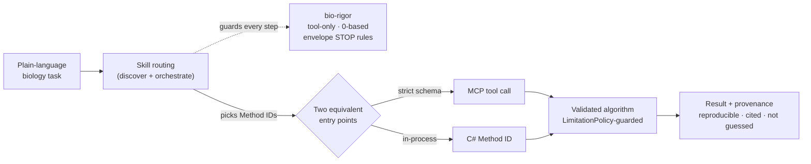
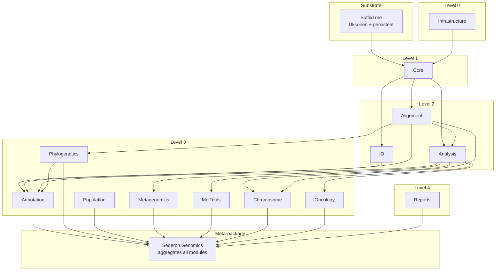

# Seqeron

**A bioinformatics toolkit for .NET 10 that you can drive in plain English.**

Seqeron is a from-scratch genomics library — 250+ algorithms, from GC-content to CRISPR guide
design — with a twist: you don't have to write code or pick tools. Describe a biology task in plain
language, and a set of AI *agent skills* chains the real, validated algorithms for you. Every number
is **computed by the library, never guessed** — and carries its own provenance.

Prefer code? The same algorithms are a normal C# API. Prefer your own agent? They're also exposed as
[MCP](https://modelcontextprotocol.io) tools. One engine, three front doors.

[](https://dotnet.microsoft.com/)
[](#project-status--validation)
[](LICENSE)
[](#build--test)
[](#3-mcp-integration)

> 🧪 **Beta — research-grade software, not for clinical or diagnostic use.**
> Seqeron is feature-complete with a stabilizing public API on the road to 1.0, and every algorithm
> unit has been validated internally against primary literature and reference tools. It has **not**
> had an external audit or regulatory clearance. Independently verify outputs before you rely on
> them, and never use them for clinical or diagnostic decisions.
> [Full status & limitations →](#project-status--validation)

---

## Contents

- [Why Seqeron](#why-seqeron)
- [Quick start](#quick-start)
- [See it work: a resistance-mutation triage](#see-it-work-a-resistance-mutation-triage)
- [Three ways to use it](#three-ways-to-use-it)
  - [1. Plain-language skills](#1-plain-language-skills)
  - [2. The C# library](#2-the-c-library)
  - [3. MCP integration](#3-mcp-integration)
- [What's inside](#whats-inside)
- [Architecture](#architecture)
- [Repository layout](#repository-layout)
- [LLM Wiki: repository knowledge for agents](#llm-wiki-repository-knowledge-for-agents)
- [Build & test](#build--test)
- [Performance & NativeAOT](#performance--nativeaot)
- [Project status & validation](#project-status--validation)
- [Documentation](#documentation)
- [Contributing](#contributing)
- [License](#license)

## Why Seqeron

Most bioinformatics lives in Python and R. Seqeron brings a broad, **cohesive** toolkit to the .NET
ecosystem — one strictly-layered library, one build, warnings-as-errors, no glue scripts — and pairs
it with an AI-native workflow that the classic stacks don't have.

| | |
|---|---|
| 🧬 **Broad & cohesive** | 250+ algorithms across alignment, annotation, variant calling, phylogenetics, population & comparative genomics, metagenomics, transcriptomics, epigenetics, RNA structure, oncology, and molecular design — all under one namespace. |
| 🗣️ **Plain-language first** | Describe the task; the matching skills load themselves, pick the right tools, and chain a correct multi-step pipeline. No schema wrangling. |
| 🔒 **Honest by construction** | A runtime `LimitationPolicy` guards each algorithm's validated scope, and results are tool-computed with provenance — the assistant never makes up a number. |
| ⚡ **Fast** | A Ukkonen suffix tree for substring queries, plus aggressive NativeAOT builds for the MCP servers. |
| ✅ **Heavily tested** | 22,000+ executed test cases across ten testing methodologies, warnings-as-errors, CI-gated on .NET 10. |
| 🔌 **Three front doors** | The same validated algorithm answers whether you go through a skill, a C# call, or an MCP tool. |

## Quick start

Clone the repo, open it in **Claude Code** (or GitHub Copilot / VS Code), and just ask:

> **install and configure**

That triggers the [`seqeron-setup`](.claude/skills/seqeron-setup) skill, which checks your toolchain
(.NET 10 SDK + Python 3), builds all 11 MCP servers into an on-demand cache, and runs a live smoke
test. Or do the same directly:

```bash
scripts/setup.sh          # build everything + verify the on-demand tool path
```

Setup is a one-time step per clone and is idempotent — re-run it any time a build looks stale. Then
**describe a biology task in plain language** and let the skills do the rest.

## See it work: a resistance-mutation triage

You hand the assistant two versions of a short gene fragment — a drug-susceptible wild type and a
clinical isolate you suspect carries a resistance mutation — and ask, in plain English:

> *"Confirm both are clean DNA, tell me exactly what changed and whether it alters the protein, and
> if it does, design me a PCR primer pair to amplify the region for a diagnostic."*

The assistant routes the task through a chain of skills. **Every number below is computed by the
library — none is guessed:**

| Step | Skill | Result |
|---|---|---|
| 1 | [`bio-qc`](.claude/skills/bio-qc) | Both are valid DNA, 57 bp; GC 49.12 % vs 50.88 %. |
| 2 | [`bio-alignment`](.claude/skills/bio-alignment) | **98.25 % identical** — a single substitution, no indels: **T→G at position 15** (0-based). |
| 3 | [`bio-annotation`](.claude/skills/bio-annotation) | Translating the frame, `…MTEAR·`**`W`**`·DLK…` → `…MTEAR·`**`G`**`·DLK…`: a **missense mutation, `p.Trp6Gly`** — it really does change the protein. |
| 4 | [`bio-moldesign`](.claude/skills/bio-moldesign) | A validated PCR pair around the site (61 bp amplicon): both primers **Tm ≈ 58.7 °C** (ΔTm 0.2 °C), no hairpin — ready for the bench. |

[`bio-rigor`](.claude/skills/bio-rigor) runs throughout — tool-only computation, 0-based coordinates,
and provenance on every result. More worked end-to-end tasks live in
[`docs/skills/golden/`](docs/skills/golden).

## Three ways to use it

The same validated algorithm answers whichever door you walk through.

### 1. Plain-language skills

A thin **routing + discipline layer** that turns the library into an agent which solves whole
biological tasks — not just single tool calls. The [Agent Skills](https://docs.anthropic.com/en/docs/claude-code/skills)
live under [`.claude/skills/`](.claude/skills) (Claude Code) with a byte-identical mirror under
[`.github/skills/`](.github/skills) (Copilot / VS Code).

**Why a skill layer at all?** With **427 tools**, an LLM drowns if you attach every schema. The
skills keep tool descriptions **out of the model's context** and instead teach it to **discover** the
right tool, **orchestrate** a correct multi-step pipeline, and stay **scientifically honest** (compute
with tools — never guess; respect each algorithm's validated envelope; carry provenance). Every recipe
is **dual-mode** — it works whether you call the MCP tool or the equivalent C# `Method ID` — so you
don't need MCP at all; the algorithms are identical either way.

**The 21 skills:**

- **Cross-cutting** — `seqeron-setup` (one-command install for a fresh clone) · `seqeron-discovery`
  (find the right tool among 427 without loading schemas) · `bio-rigor` (tool-only computation,
  provenance, envelope STOP rules) · `seqeron-dev` (the C# API path: namespaces, `LimitationPolicy`,
  `TryCreate`) · `seqeron-python-client` (wrap any tool in a small Python script).
- **Domains** — `bio-qc` · `bio-alignment` · `bio-assembly` · `bio-annotation` · `bio-moldesign` ·
  `bio-phylo-popgen` · `bio-metagenomics` · `bio-chromosome` · `seqeron-rna-structure` ·
  `seqeron-protein-features` · `seqeron-transcriptome` · `seqeron-epigenetics` ·
  `seqeron-comparative-genomics` · `seqeron-oncology` · `seqeron-mirna` · `seqeron-structural-variants`.

An [auto-generated catalog](docs/skills/_generated) plus a CI guardrail keep the skills in sync with
the tools (no drift). Plan of record: [`docs/skills/STRATEGY.md`](docs/skills/STRATEGY.md).

### 2. The C# library

```csharp
using Seqeron.Genomics;

var dna = new DnaSequence("AAAGAATTCAAA");

Console.WriteLine($"Length:  {dna.Length}");
Console.WriteLine($"GC%:     {dna.GcContent():F2}");
Console.WriteLine($"RevComp: {dna.ReverseComplement()}");

// Fast motif lookup via suffix tree
bool hasEcoRI = dna.SuffixTree.Contains("GAATTC");
Console.WriteLine($"EcoRI site: {hasEcoRI}");
```

Prefer to validate input instead of throwing? Every sequence type has a `TryCreate`:

```csharp
if (!DnaSequence.TryCreate("ACGTNN", out var seq))
    Console.WriteLine("Invalid DNA sequence");
else
    Console.WriteLine(seq.GcContent());
```

### 3. MCP integration

MCP lets any LLM call Seqeron tools with **strict schemas and reproducible outputs** — LLM-native
bioinformatics. Because each call is a real algorithm, the results are deterministic and every step
is auditable.

**Start here:** [What is MCP](docs/mcp/README.md#what-is-mcp) ·
[What you get](docs/mcp/README.md#what-you-get-in-practice) ·
[How to connect](docs/mcp/README.md#how-to-connect-a-server-to-your-llm-tool) ·
[How to use](docs/mcp/README.md#how-to-use-in-practice) ·
[Why servers are split](docs/mcp/README.md#servers-in-this-repo-and-why-split) ·
[Connect to Codex/IDE](docs/mcp/README.md#connect-to-codex-cli-or-ide)

<details>
<summary><b>Worked example — cloning-insert QC</b> (GC% + restriction sites, every step traced)</summary>

**Task:** given an insert in FASTA, report GC% and whether it contains EcoRI (`GAATTC`) or BamHI
(`GGATCC`) sites (0-based positions) — a standard cloning QC step.

**Prompt:**

```
Use tools only; no manual parsing or calculations. I have a cloning insert in FASTA below.
Read the sequence with tools, then report GC% (2 decimals) and any EcoRI (GAATTC) / BamHI
(GGATCC) sites as 0-based positions, as a Markdown table (id, length, gc_percent, EcoRI_sites,
BamHI_sites). Sites as JSON arrays. Output only the table.

>seq1
GCGCGAATTCATGGATCCATAT
```

**Result:**

```
| id   | length | gc_percent | EcoRI_sites | BamHI_sites |
|------|-------:|-----------:|-------------|-------------|
| seq1 |     22 |      45.45 | [4]         | [12]        |
```

**Tools used, in order:** `fasta_parse` → `gc_content` (45.45, 10/22) →
`suffix_tree_find_all` `GAATTC` → `[4]` → `suffix_tree_find_all` `GGATCC` → `[12]`.

</details>

<details>
<summary><b>Worked example — PCR primer QC</b> (validity + GC% + Tm + ΔTm)</summary>

**Task:** validate two primers, compute GC% and Tm, and report the Tm difference — a routine
pre-screen before PCR.

**Prompt:**

```
Use tools only. These are PCR primers in FASTA. Read them with tools, confirm each is valid DNA,
report GC% (2 decimals) and Tm in °C (1 decimal) as a Markdown table (id, length, gc_percent,
tm_c), then a line: tm_diff_c = |Tm_FWD - Tm_REV|.

>FWD
ATGCGATCGATCGATCGTAG
>REV
GCGCGATCGATCGATCGCAA
```

**Result:**

```
| id  | length | gc_percent | tm_c |
|-----|-------:|-----------:|-----:|
| FWD |     20 |      50.00 | 51.8 |
| REV |     20 |      60.00 | 55.9 |

tm_diff_c = 4.1
```

**Tools used, in order:** `fasta_parse` → `dna_validate` ×2 → `gc_content` ×2 →
`melting_temperature` ×2.

</details>

**How a task flows** — the same validated algorithm answers whether you go through MCP or the C# API:


```mermaid
flowchart LR
    U["Plain-language<br/>biology task"] --> SK["Skill routing<br/>(discover + orchestrate)"]
    SK -.->|"guards every step"| RIG["bio-rigor<br/>tool-only · 0-based<br/>envelope STOP rules"]
    SK -->|"picks Method IDs"| P{"Two equivalent<br/>entry points"}
    P -->|"strict schema"| MCP["MCP tool call"]
    P -->|"in-process"| API["C# Method ID"]
    MCP --> ALG["Validated algorithm<br/>LimitationPolicy-guarded"]
    API --> ALG
    ALG --> OUT["Result + provenance<br/>reproducible · cited · not guessed"]
```

Tool schemas and examples: [Core](docs/mcp/tools/core) · [Sequence](docs/mcp/tools/sequence) ·
[Parsers](docs/mcp/tools/parsers).

## What's inside

- **Sequence models** — DNA / RNA / Protein with validation and the everyday operations
  (transcribe, translate, reverse-complement, composition, Tm, molecular weight, pI, …).
- **Parsers & writers** — FASTA, FASTQ, GenBank, GFF, VCF, BED, EMBL.
- **A broad algorithm library** — alignment (global / local / semi-global / MSA); k-mer, motif,
  repeat, and complexity analysis; annotation and variant calling; phylogenetics and population
  genetics; metagenomics; comparative and structural genomics; transcriptome analysis and
  translation; RNA secondary structure; epigenetics; oncology; chromosome-level analysis; and
  molecular tools (primer / probe / CRISPR design, codon optimization, restriction analysis).
- **A high-performance suffix tree** (Ukkonen) for fast substring queries, plus a persistent
  on-disk variant.
- **11 MCP servers** exposing the toolsets to LLM/agent workflows — one per domain, plus the core
  suffix-tree server.
- **Evidence-based validation** — algorithm parameters and coefficients reproduced from primary
  literature and reference implementations, tracked per unit under [docs/Validation](docs/Validation).

## Architecture

The library is a strictly layered set of packages — dependencies only ever point *up* the levels,
never sideways within a level or downward (enforced by architecture tests). An arrow `A --> B` means
**B depends on A**. Every module also references `Core` + `Infrastructure` (Levels 0–1); those
universal edges are drawn only where they define the layer, to keep the graph readable.


```mermaid
graph TD
    subgraph "Substrate"
        ST[SuffixTree<br/>Ukkonen + persistent]
    end
    subgraph "Level 0"
        INF[Infrastructure]
    end
    subgraph "Level 1"
        CORE[Core]
    end
    subgraph "Level 2"
        IO[IO]
        ALN[Alignment]
        ANA[Analysis]
    end
    subgraph "Level 3"
        ANN[Annotation]
        PHY[Phylogenetics]
        POP[Population]
        META[Metagenomics]
        MOL[MolTools]
        CHR[Chromosome]
        ONC[Oncology]
    end
    subgraph "Level 4"
        REP[Reports]
    end
    subgraph "Meta-package"
        GEN[Seqeron.Genomics<br/>aggregates all modules]
    end

    ST --> CORE
    INF --> CORE
    CORE --> IO
    CORE --> ALN
    CORE --> ANA
    ALN --> ANA

    ALN --> PHY
    ANA --> META
    ANA --> MOL
    ANA --> ONC
    ALN --> CHR
    ANA --> CHR
    IO --> ANN
    ALN --> ANN
    ANA --> ANN
    PHY --> ANN

    ANN --> GEN
    PHY --> GEN
    POP --> GEN
    META --> GEN
    MOL --> GEN
    CHR --> GEN
    ONC --> GEN
    REP --> GEN
```

## Repository layout

```
Seqeron.sln
Directory.Build.props        # Solution-wide defaults (net10.0, nullable, warnings-as-errors, deterministic)
Directory.Packages.props     # Central Package Management — every NuGet version pinned in one place
.editorconfig                # Shared formatting / code-style baseline
.github/workflows/dotnet.yml # CI: restore → build (warnings-as-errors) → full test suite
src/
├── SuffixTree/              # Ukkonen suffix tree (+ persistent) and its MCP server
└── Seqeron/
    ├── Algorithms/          # The genomics modules (Core, IO, Alignment, Analysis, Annotation,
    │                        #   Phylogenetics, Population, Metagenomics, MolTools, Chromosome,
    │                        #   Oncology, Reports) + the Seqeron.Genomics meta-package
    └── Mcp/                 # One MCP server per domain (Sequence, Parsers, Alignment, Analysis,
                             #   Annotation, Phylogenetics, Population, Metagenomics, Chromosome, MolTools)
tests/                       # Per-module + per-server test suites (the bulk of the codebase)
apps/                        # Benchmarks, stress/verification harness, genome demo
docs/                        # Algorithms, MCP guide, skills strategy, validation ledger
wiki/                        # LLM-curated navigation layer over the repository documentation
```

## LLM Wiki: repository knowledge for agents

Seqeron includes an [LLM Wiki](https://gist.github.com/karpathy/442a6bf555914893e9891c11519de94f):
a compact, linked knowledge layer that helps an agent find the right project fact before loading large
parts of the repository. It complements the plain-language skills, C# API, and MCP tools: skills route
biology tasks, MCP executes algorithms, and the wiki answers questions about **how this repository is
designed, validated, connected, and constrained**.

The source of truth remains the repository documentation — everything under `docs/**` plus root
Markdown files such as `README.md`, `ALGORITHMS_CHECKLIST_V2.md`, and `ALGORITHMS_ROADMAP.md`.
Curated pages under [`wiki/`](wiki) summarize and connect those sources; they record the source path and
commit rather than replacing or editing the originals. There is intentionally no copied `raw/` tree.

### How retrieval works

1. Start at the 13-line [`wiki/index.md`](wiki/index.md) and open only the smallest relevant shard.
2. Follow concise `[[wikilinks]]`, or use BM25 search when the index is not specific enough.
3. Read the relevant concept/source page and traverse backlinks or typed graph edges when relationships
   matter.
4. Follow `sources:` / `doc_path:` to the authoritative repository document before making a
   high-stakes claim; cite the answer with `[[wikilinks]]`.

This is retrieval, not a second source of truth. Every derived page carries provenance,
`source_commit` enables deterministic staleness checks, and the compiled graph is disposable —
Markdown remains canonical.

### Measured context reduction

These figures describe the repository state in the same Git revision as this README. Counts use
`wiki_stats.py` plus `docs/**/*.md` and root `*.md`; both surfaces use whitespace-delimited words:

| | Without the LLM Wiki | With the LLM Wiki |
|---|---:|---:|
| Discovery surface | 1,184 source files · 170,297 lines · 1,376,174 words | 13-line index + a relevant shard (largest: 222 lines) |
| One-page lookup context | Repository-wide search may expose up to 170,297 source lines | Worst-case indexed discovery: 235 lines; then a 102-line average curated page |
| Explicit knowledge structure | No normalized cross-document graph | 532 pages · 4,639 wikilinks · 532 graph nodes · 4,251 edges |
| Curated knowledge volume | None | 54,696 lines · 446,659 words |
| Provenance freshness | Manual source/history inspection | `source_commit` on every derived page; current stale count: 0 |

For a representative one-page lookup, index + largest shard + average page is **337 lines versus
170,297 source lines (~505× less discovery context)**. This is a context-size comparison, not a claim
that the wiki replaces reading the source or improves model correctness by a fixed percentage.

### Example questions

Ask naturally when the `llm-wiki` skill is available:

> `/wiki:query Which primer-design path uses full thermodynamic dimer Tm instead of the fast
> structural screen? Cite the relevant wiki pages.`

> `/wiki:query How does k-mer search depend on canonical k-mer counting, and which validation report
> supports that relationship?`

> `/wiki:query What are the validated limits of Seqeron's oncology algorithms, and where is each
> limitation enforced?`

Or query the local indexes directly:

```bash
# Ranked discovery without collapsing distinct derived concepts
python .claude/skills/llm-wiki/scripts/wiki_search.py \
  "primer dimer thermodynamics" --wiki wiki --top 5 \
  --dedup-provenance --prefer-type concept

# Every page that links to a concept
python .claude/skills/llm-wiki/scripts/wiki_search.py \
  --wiki wiki --backlinks primer-design

# Typed facts and their exact source pages
python .claude/skills/llm-wiki/scripts/wiki_graph_query.py \
  wiki facts --about concept:k-mer-counting
```

### Keep it trustworthy

```bash
# One-time: enable the repository's pre-commit wiki guard
git config core.hooksPath .githooks

# Structural/link/index-limit health, provenance freshness, and typed-edge integrity
python .claude/skills/llm-wiki/scripts/wiki_lint.py wiki
python .claude/skills/llm-wiki/scripts/wiki_stale.py wiki
python .claude/skills/llm-wiki/scripts/wiki_graph_lint.py wiki

# Link-extraction and wiki-tool business rules, with the blocking coverage threshold
python -m pip install coverage pyyaml  # one-time Python tooling dependencies
python -m coverage run --rcfile=.claude/skills/llm-wiki/.coveragerc -m unittest discover -s .claude/skills/llm-wiki/tests
python -m coverage report --rcfile=.claude/skills/llm-wiki/.coveragerc

# Rebuild the disposable graph after Markdown graph metadata changes
python .claude/skills/llm-wiki/scripts/wiki_graph_extract.py wiki
```

When a source changes, run `/wiki:ingest <repo-relative-path>` (for example,
`/wiki:ingest README.md`), update only the affected pages and index entry, and append one line to
[`wiki/log.md`](wiki/log.md). Page types, frontmatter, size limits, graph provenance, and the exact
staleness rule are defined in [`wiki/SCHEMA.md`](wiki/SCHEMA.md).

## Build & test

```bash
dotnet build          # Release build; warnings are errors on every project
dotnet test           # full suite — 22,000+ cases across every assembly
```

Shared build settings are centralized so all 47 projects stay consistent:

- **[Central Package Management](Directory.Packages.props)** — every NuGet version declared once;
  project files carry no `Version` attributes.
- **[`Directory.Build.props`](Directory.Build.props)** — one place for `net10.0`, nullable, implicit
  usings, deterministic builds, and `TreatWarningsAsErrors` (applied to *every* project).
- **CI** — [`.github/workflows/dotnet.yml`](.github/workflows/dotnet.yml) restores, builds
  (warnings-as-errors), and runs the full suite on every push/PR.

Wall-clock **performance / benchmark** tests are marked `[Explicit]` so they never flake the parallel
gate; run them on demand:

```bash
dotnet test --filter "TestCategory=Performance"     # opt-in timing / complexity guards
```

## Performance & NativeAOT

Performance-critical libraries and all MCP-server executables are configured for aggressive
NativeAOT compilation — no JIT/CLR at runtime, native instruction sets for the build CPU, and a
much smaller binary.

**Libraries** (`SuffixTree.Core`, `SuffixTree`, `SuffixTree.Persistent`) opt into
`IsAotCompatible` + `IsTrimmable`. **Executables** (every `Seqeron.Mcp.*`, `SuffixTree.Mcp.Core`,
and the `SuffixTree.Console` harness) enable full `PublishAot`:

```xml
<PublishAot>true</PublishAot>
<OptimizationPreference>Speed</OptimizationPreference>       <!-- aggressive inlining, loop unrolling -->
<IlcInstructionSet>native</IlcInstructionSet>               <!-- AVX2/SSE4.2/BMI2/POPCNT for this CPU -->
<IlcFoldIdenticalMethodBodies>true</IlcFoldIdenticalMethodBodies>
<StripSymbols>true</StripSymbols>
<InvariantGlobalization>true</InvariantGlobalization>       <!-- drop ICU (~30 MB); genomics needs no culture -->
```

Publishing requires the [Desktop Development with C++](https://aka.ms/nativeaot-prerequisites)
workload:

```bash
dotnet publish -c Release -r win-x64
```

<details>
<summary><b>Benchmark strategy & baseline numbers</b></summary>

The benchmark project uses a **two-phase strategy** to avoid the common pitfall of BenchmarkDotNet
re-compiling AOT for every benchmark method (which causes multi-hour "freezes"): a fast JIT baseline,
a single NativeAOT publish, then run the pre-compiled binary with the `InProcessNoEmitToolchain`
(`--inprocess`) so it benchmarks itself without spawning child processes.

```bash
# 1. JIT baseline (~3 min)
dotnet run --project apps/SuffixTree.Benchmarks -c Release -f net10.0 -- \
  --filter "*Build_Short*" "*Build_DNA*" "*Contains*" "*LRS*" --iterationCount 3 --warmupCount 1

# 2. Publish NativeAOT once (~5 min)
dotnet publish apps/SuffixTree.Benchmarks -c Release -r win-x64 -f net10.0 \
  /p:PublishAot=true /p:OptimizationPreference=Speed /p:IlcInstructionSet=native \
  /p:IlcFoldIdenticalMethodBodies=true /p:StripSymbols=true /p:InvariantGlobalization=true

# 3. Run the AOT binary in-process (~3 min)
./apps/SuffixTree.Benchmarks/bin/Release/net10.0/win-x64/publish/SuffixTree.Benchmarks.exe \
  --inprocess --filter "*Build_Short*" "*Build_DNA*" "*Contains*" "*LRS*"
```

JIT baseline (11th Gen Intel Core i7-1185G7, 4C/8T, AVX-512):

| Method | Mean | Allocated |
|:-------|-----:|----------:|
| LRS_Short | 21.2 ns | 32 B |
| LRS_DNA | 23.5 ns | 56 B |
| Contains_Short | 43.8 ns | 0 B |
| Contains_DNA | 107.4 ns | 0 B |
| Build_Short | 18.3 µs | 19 KB |
| Build_DNA (50K) | 50.7 ms | 8.5 MB |

</details>

## Project status & validation

Seqeron is in **beta**: feature-complete, with a public API that is stabilizing toward 1.0. Public
APIs may still change between releases. Here is exactly where it stands — the good and the caveats.

**What has been done** (verifiable in this repo):

- **Extensive automated testing** — 22,000+ executed test cases (`[Test]` methods plus parametrized
  `[TestCase]` / combinatorial expansions) across 258 algorithm units, with roughly 3.8× more test
  code than product code. The full suite is green on .NET 10, warnings-as-errors, CI-gated.
- **Ten complementary test methodologies** — each catches a different class of defect, and each has
  a per-algorithm checklist under [docs/checklists](docs/checklists):

  | Methodology | What it catches |
  |---|---|
  | **Property-based** (FsCheck) | Invariant violations across thousands of *generated* inputs, not just hand-picked cases. |
  | **Metamorphic** | Wrong outputs when the exact answer is unknown, by asserting relations between related inputs (e.g. `revcomp(revcomp(x)) == x`). |
  | **Fuzzing** | Crashes and unhandled edge cases from malformed, random, or adversarial input. |
  | **Mutation** (Stryker.NET) | *Weak tests* — seeds deliberate bugs into the code and fails if the suite doesn't notice. |
  | **Snapshot / approval** (Verify) | Unintended changes to complex outputs, locked against reviewed baselines. |
  | **Algebraic** | Broken algebraic laws the operations must obey — identity, inverse, idempotence, commutativity. |
  | **Architecture** (ArchUnitNET) | Layering / dependency-rule drift in the package graph. |
  | **Differential** | Divergence from an independent or reference implementation of the same algorithm. |
  | **Combinatorial / pairwise** | Interaction bugs across large parameter-combination spaces, covered efficiently. |
  | **Characterization** | Regressions during refactoring, by pinning current behaviour. |
- **A per-unit internal validation campaign** — a documented findings register, a published
  limitations / operating-envelope document, and a runtime `LimitationPolicy` that guards algorithms
  used outside their validated scope. One report per unit under
  [docs/Validation/reports](docs/Validation/reports); index in [docs/Validation](docs/Validation).
- **Literature-traced parameters** — algorithm coefficients reproduced from primary literature and
  reference implementations, tracked per unit.

**What has *not* been done** — and why you must still validate before relying on it:

- No **third-party / external** audit, peer review, or regulatory clearance.
- No certification for clinical, diagnostic, or decision-making use.
- Many algorithms are faithful but **simplified or subset** realisations of fuller published
  methods; their honest scope is documented in
  [LIMITATIONS.md](docs/Validation/LIMITATIONS.md).

**Before using with real data or in production:** independently verify all outputs against
established tools for your specific use case, and do not use Seqeron for clinical or diagnostic
decision-making without your own qualification and validation.

**Disclaimer.** The authors and contributors make no warranties regarding correctness, reliability,
or fitness for any particular purpose. Use at your own risk; the authors shall not be liable for any
damages, losses, or harm arising from the use or misuse of this software. See [LICENSE](LICENSE) for
full terms.

## Documentation

**For study**

- Start here: [Algorithms index](docs/algorithms/README.md).
- Areas: [Annotation](docs/algorithms/Annotation) · [K-mer](docs/algorithms/K-mer) ·
  [Pattern Matching](docs/algorithms/Pattern_Matching) ·
  [Repeat Analysis](docs/algorithms/Repeat_Analysis) ·
  [Sequence Composition](docs/algorithms/Sequence_Composition) ·
  [MolTools](docs/algorithms/MolTools).
- [Suffix Tree (Ukkonen)](docs/algorithms/Pattern_Matching/Suffix_Tree.md).

**For development**

- MCP guide: [docs/mcp/README.md](docs/mcp/README.md) ·
  traceability: [docs/mcp/traceability.md](docs/mcp/traceability.md).
- Skills strategy & worked tasks: [docs/skills/STRATEGY.md](docs/skills/STRATEGY.md) ·
  [docs/skills/golden](docs/skills/golden).
- Validation: [docs/Validation](docs/Validation) ·
  [LIMITATIONS.md](docs/Validation/LIMITATIONS.md).
- Algorithm test specifications: [tests/TestSpecs](tests/TestSpecs).
- LLM Wiki: [knowledge layer, measured impact, queries, and maintenance](#llm-wiki-repository-knowledge-for-agents) ·
  [schema](wiki/SCHEMA.md).

## Contributing

**External review is exactly what would move this project past its current, self-validated state** —
so audits, bug reports, and corrections are actively welcomed. If you find an error in any algorithm
implementation, please open an issue or submit a pull request. Builds are warnings-as-errors and the
full test suite runs on every push/PR, so run `dotnet build` and `dotnet test` before you submit.

## License

MIT — see [LICENSE](LICENSE).
